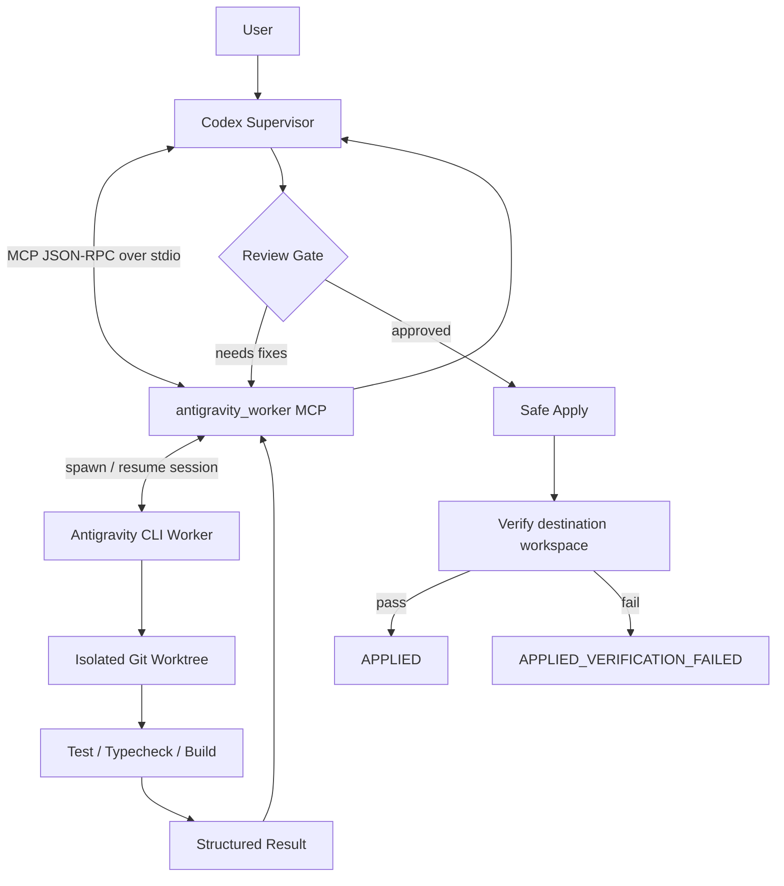

# codex_agy

Codex + Antigravity CLI multi-agent coding architecture.

## Goal

Use **Codex as the supervisor/architect** and **Antigravity CLI (AGY) as the worker**.

- Codex analyzes the user request, decomposes work, reviews diffs, and decides whether changes may be applied.
- AGY edits code, runs tests, and reports structured results.
- MCP is the control/message channel.
- Git worktrees isolate AGY changes from the main workspace.
- A Safe Apply gate verifies changes before they reach the main branch/workspace.

## High-level architecture

## Documents

- [Architecture](docs/ARCHITECTURE.md)
- [Communication protocol](docs/PROTOCOL.md)
- [Implementation roadmap](docs/ROADMAP.md)

## Core principle

**Messages travel through MCP; code travels through Git.**

Codex and AGY should not both freely edit the same working tree.
