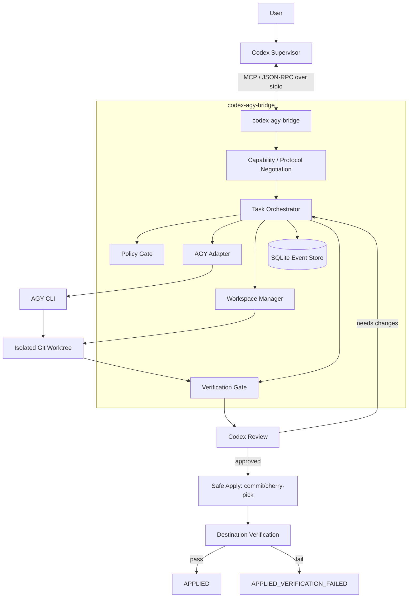

# codex_agy

Production-oriented architecture for **Codex as supervisor** and **Antigravity CLI (AGY) as coding worker**.

## Design goals

1. Codex owns reasoning, decomposition, review, and final apply decisions.
2. AGY owns implementation inside an isolated worktree.
3. MCP carries control messages; Git carries code.
4. Worker-specific CLI behavior is hidden behind an adapter.
5. Task state survives process restarts.
6. Applying changes is transactional and verifiable.
7. The bridge negotiates MCP capabilities and does not hard-code a single protocol revision.
8. Local-first: stdio + SQLite + Git. No Redis, queue broker, or HTTP service unless scaling later requires them.

## Optimized architecture



## Core rule

> **Messages travel through MCP. Code travels through Git. Durable workflow state lives in SQLite.**

Codex and AGY never freely edit the same working tree.

## Logical identifiers

- `task_id`: durable unit of delegated work.
- `conversation_id`: AGY-specific resumable conversation, managed only by `AGYAdapter`.
- `workspace_id`: isolated worktree assigned to a task.
- `attempt_id`: one worker execution/retry attempt.
- `apply_id`: one atomic apply attempt.

These identifiers are intentionally separate. An MCP connection/session is not treated as durable task state.

## Minimal bridge API

Business-level tools stay small:

- `delegate_task`
- `continue_task`
- `inspect_task`
- `cancel_task`

Where supported by the active MCP client/server capabilities, lifecycle operations should map to standardized MCP task primitives. A compatibility layer may expose equivalent behavior when the client does not support them.

## Repository documentation

- [Architecture](docs/ARCHITECTURE.md)
- [Protocol and API](docs/PROTOCOL.md)
- [Task model](docs/TASK_MODEL.md)
- [Worktrees and Safe Apply](docs/WORKTREE_SAFE_APPLY.md)
- [Failure recovery](docs/FAILURE_RECOVERY.md)
- [Security model](docs/SECURITY.md)
- [Configuration](docs/CONFIGURATION.md)
- [Test plan](docs/TEST_PLAN.md)
- [Architecture decisions](docs/DECISIONS.md)
- [Implementation roadmap](docs/ROADMAP.md)

## Planned source layout

```text
src/
  server/          MCP transport, discovery, capability negotiation
  orchestrator/    task state machine and workflow coordination
  adapters/agy/    all AGY CLI/session/process details
  workspace/       git worktree lifecycle
  apply/           commit validation, cherry-pick, rollback
  verify/          test/typecheck/build verification
  policy/          command/path/network/secret policy
  store/           SQLite repositories + event log
  domain/          task/result/error schemas
  observability/   structured logs, correlation IDs, metrics hooks
```

## Non-goals for v1

No WebSocket service, Redis, RabbitMQ, Kafka, Kubernetes, distributed locking, or multi-host scheduler. Those add complexity without helping the initial single-machine Codex + AGY workflow.
