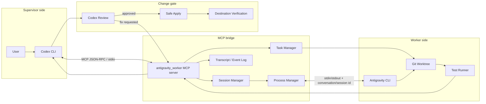
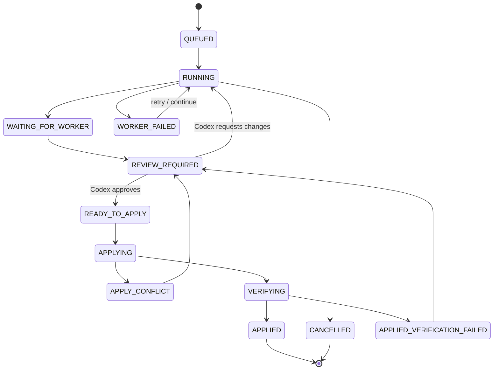
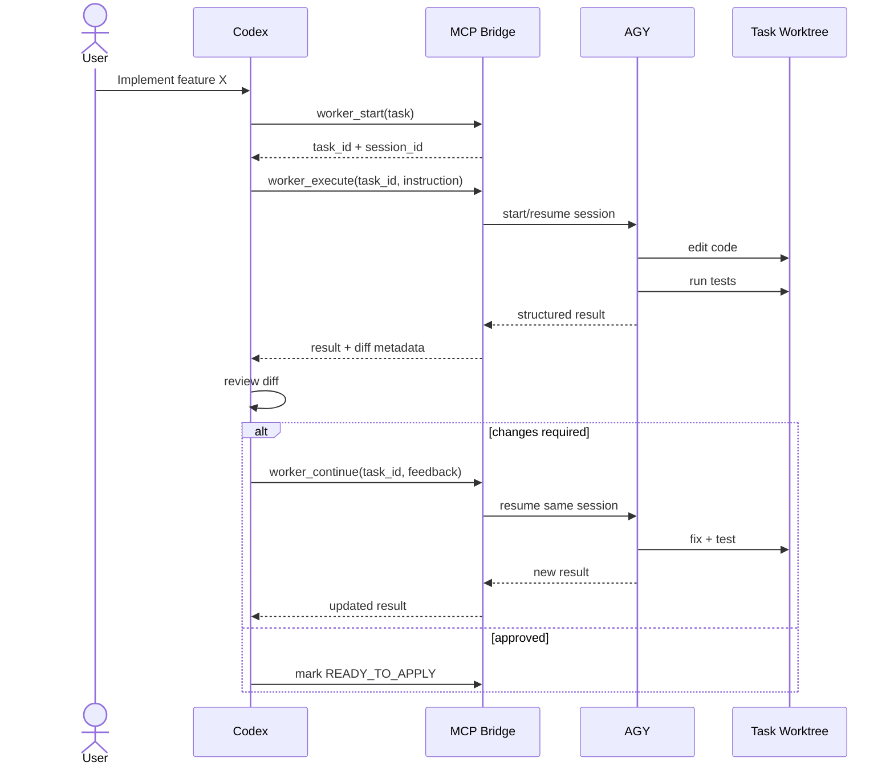

# Architecture

## 1. Design goals

The system should:

1. Let Codex delegate implementation work to AGY.
2. Keep AGY execution-focused and cheaper to use.
3. Let Codex review and request fixes over multiple turns.
4. Preserve task/session context so AGY can continue previous work.
5. Prevent AGY from damaging the primary workspace.
6. Keep every task auditable: prompt, result, diff, tests, state transitions.
7. Allow the transport to move from local stdio to remote HTTP later without redesigning the agent contract.

## 2. Component architecture



## 3. Communication layers

There are two separate channels by design.

### Control/message plane

```text
Codex
  ⇅
MCP JSON-RPC over stdio
  ⇅
antigravity_worker
  ⇅
AGY process/session
```

Used for task instructions, questions and answers, status, test summaries, error classification, session continuation, and cancellation.

### Code/data plane

```text
Main repository
      │
      ├── primary workspace (Codex reviews here)
      │
      └── task worktree (AGY edits here)
```

Used for files, diffs, commits, tests, and build artifacts. Large source files do not need to be copied through prompts.

## 4. Suggested MCP tool contract

```text
worker_start
worker_execute
worker_continue
worker_status
worker_get_result
worker_cancel
```

### worker_start

Creates a durable task and optionally a new AGY conversation/session.

```json
{
  "task_id": "task-123",
  "session_id": "agy-session-abc",
  "state": "QUEUED"
}
```

### worker_execute

Starts or executes work for a task.

```json
{
  "task_id": "task-123",
  "workspace": "/repo",
  "instruction": "Implement Google OAuth login",
  "verification": [
    "bun test",
    "bun run typecheck",
    "bun run build"
  ]
}
```

### worker_continue

Continues the same AGY conversation after Codex review.

```json
{
  "task_id": "task-123",
  "message": "Fix the token-expiry race and add a regression test."
}
```

### worker_status

Returns state, process health, current session, worktree, and latest event.

### worker_get_result

Returns the structured latest/final result.

### worker_cancel

Stops the AGY process safely while preserving enough metadata to resume later when possible.

## 5. Task state machine



## 6. Multi-turn review loop



## 7. Worktree model

Recommended layout:

```text
/repo
├── .git/
├── src/
├── ...
└── .codex-agy/
    ├── tasks/
    │   └── task-123.json
    ├── logs/
    │   └── task-123.jsonl
    └── worktrees/
        └── task-123/   -> actual Git worktree
```

If nested worktrees cause tool issues, keep worktrees outside the repository root.

Each task metadata record should contain at least:

```json
{
  "task_id": "task-123",
  "workspace": "/repo",
  "worktree": "/repo/.codex-agy/worktrees/task-123",
  "branch": "codex-agy/task-123",
  "session_id": "agy-session-abc",
  "state": "RUNNING",
  "base_commit": "...",
  "head_commit": "...",
  "created_at": "...",
  "updated_at": "..."
}
```

## 8. Structured worker result

AGY output should be normalized before Codex consumes it.

```json
{
  "status": "REVIEW_REQUIRED",
  "summary": "Implemented Google OAuth login",
  "files_changed": [
    "src/auth/google.ts",
    "src/routes/login.ts"
  ],
  "tests": [
    {
      "command": "bun test",
      "exit_code": 0,
      "summary": "42 passed"
    }
  ],
  "commit": "abc123",
  "known_issues": [],
  "worker_message": "Ready for review"
}
```

Codex should never depend on prose parsing alone for critical state transitions.

## 9. Failure classification

Normalize failures into:

```text
IMPLEMENTATION
PROTOCOL
PROVIDER
INFRASTRUCTURE
```

Examples:

- **IMPLEMENTATION**: tests fail because AGY code is wrong.
- **PROTOCOL**: malformed MCP result or missing required field.
- **PROVIDER**: AGY/model provider rejects or times out.
- **INFRASTRUCTURE**: Git/worktree/process/filesystem failure.

## 10. Safety rules

1. AGY should not edit the primary workspace directly.
2. Every apply must have an expected base commit.
3. Detect destination changes before apply.
4. Never silently resolve dangerous conflicts.
5. Run verification after changes are applied to the destination, not only inside the worker worktree.
6. Persist task/session IDs before launching AGY.
7. Capture AGY exit code and last output even on crashes.
8. Allow explicit cancellation and recovery.
9. Log commands that mutate Git state.
10. Secrets and environment variables must not be copied into transcripts by default.

## 11. Future remote mode

Local v1:

```text
Codex -- MCP stdio --> bridge -- local process --> AGY
```

Possible remote v2:

```text
Codex -- MCP Streamable HTTP --> bridge service --> remote AGY worker
```

The task/result schema should remain the same so transport can change without changing Codex behavior.
