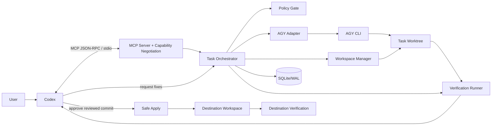
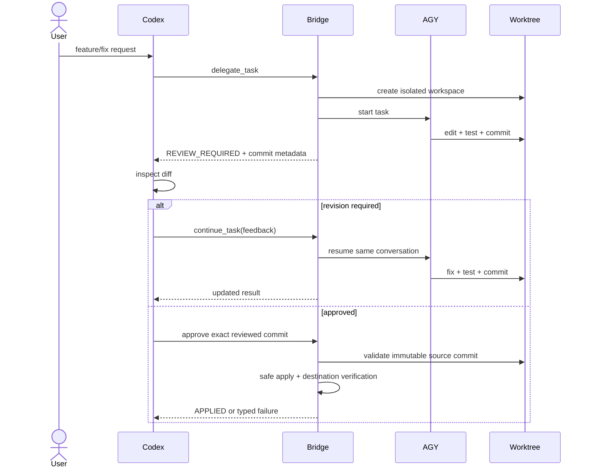

# Architecture v2

## Purpose

`codex_agy` is a local-first orchestration bridge where Codex supervises and reviews while Antigravity CLI (AGY) performs implementation work inside an isolated Git worktree.

## System architecture



## Responsibility boundaries

### Codex

- understand user intent;
- decompose work;
- choose what to delegate;
- review worker results/diffs;
- request revisions;
- explicitly approve the exact commit to apply;
- take over difficult work only when escalation policy says so.

### MCP server

- protocol discovery/negotiation;
- expose a small stable business API;
- normalize MCP/version differences;
- never own worker-specific CLI semantics.

### Task Orchestrator

- durable task state machine;
- idempotency;
- leases/concurrency control;
- retries/cancellation;
- workflow sequencing;
- recovery reconciliation.

### AGY Adapter

- detect AGY capabilities/version;
- spawn/resume/cancel AGY processes;
- manage `conversation_id`;
- normalize stdout/stderr/provider errors into typed results;
- hide every AGY-specific flag from the orchestrator.

### Workspace Manager

- canonical repository identity;
- create/reconcile/remove task worktrees;
- track `base_sha`, branch, reviewed commits;
- ensure AGY mutates only its assigned worktree.

### Verification Runner

- execute bounded test/typecheck/build commands;
- stream/cap output;
- persist command, exit code, duration and summary;
- distinguish task-worktree verification from destination verification.

### SQLite Store

SQLite + WAL stores durable workflow metadata. Git is authoritative for source code; SQLite is authoritative for workflow state.

## Control plane vs code plane

```text
CONTROL PLANE
Codex <-> MCP <-> Orchestrator <-> AGY Adapter

CODE PLANE
Destination Git repo <-> task branch/worktree <-> reviewed commit <-> cherry-pick
```

Large code blobs are never the primary MCP payload.

## Stable identifiers

```text
task_id          durable engineering task
conversation_id  AGY resumable conversation
workspace_id     task worktree identity
attempt_id       one execution/resume attempt
apply_id         one safe-apply transaction
```

No durable task state depends on the lifetime of an MCP connection or process PID.

## Public business API

Keep Codex-facing operations intentionally small:

```text
delegate_task
continue_task
inspect_task
cancel_task
```

Lifecycle/status functionality may map to standardized MCP task capabilities when negotiated. The compatibility layer provides equivalent behavior when unavailable.

## Concurrency model

V1 defaults to one active AGY worker for simplicity. Architecture supports a configurable small parallelism limit later.

Rules:

- one mutation lease per `task_id`;
- one owned worktree per active task;
- independent tasks may run concurrently only when configured;
- same-task duplicate calls are idempotent;
- Safe Apply serializes mutations against the destination repository.

## Durable event model

Persist both:

```text
tasks        current snapshot for fast reads
task_events  append-only transition/audit history
```

Important mutations follow:

```text
validate -> begin SQLite transaction -> append event/update snapshot -> commit -> report success
```

External processes and Git mutations require reconciliation records so a crash between filesystem/Git and SQLite steps can be repaired deterministically.

## Review loop



## Safe Apply

Primary apply strategy is Git commit/cherry-pick, never blind file copying.

Preconditions:

- source commit exists and matches reviewed commit;
- task worktree is in expected state;
- destination state is captured;
- destination is not unexpectedly dirty;
- source/destination relationship is revalidated.

After cherry-pick, run destination verification. `APPLIED` is impossible until it passes.

See [WORKTREE_SAFE_APPLY.md](WORKTREE_SAFE_APPLY.md).

## Recovery model

In-memory state is disposable. After restart, reconcile SQLite, Git worktrees and process reality. Preserve task/worktree/conversation evidence and avoid auto-applying uncertain state.

See [FAILURE_RECOVERY.md](FAILURE_RECOVERY.md).

## Security model

AGY is a scoped executor, not a trusted host administrator. It receives an explicit environment and primarily writable access to its task worktree. Privileged/destructive operations are denied by default.

See [SECURITY.md](SECURITY.md).

## Scaling path

Only after local mode is reliable:

```text
stdio/local AGY
   -> optional Streamable HTTP bridge
   -> remote worker adapter/registry
   -> scheduler if real multi-host demand exists
```

The domain/task schema must remain transport-independent so scaling does not require redesigning the workflow.
