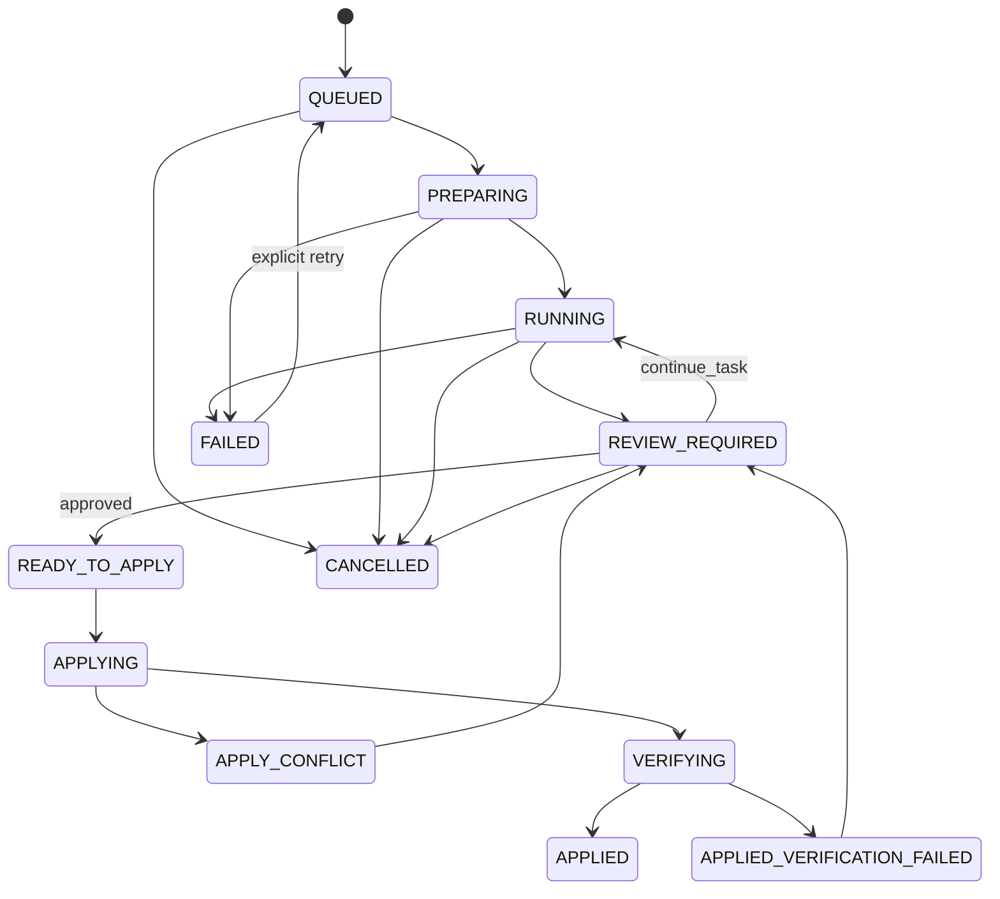

# Task Model

## Identity

A delegated unit of work uses separate durable identifiers:

```text
task_id         stable business task
conversation_id AGY resumable conversation
workspace_id    isolated git worktree
attempt_id      individual worker execution
apply_id        individual apply transaction
```

Never overload one identifier to mean another.

## Canonical task state



Terminal states are `APPLIED` and `CANCELLED`. `FAILED` is recoverable only through an explicit retry operation.

## Task invariants

- At most one active mutation attempt per `task_id`.
- Exactly one owned worktree per active task.
- Every state transition is appended to the event log before externally reporting success.
- `continue_task` reuses the existing `conversation_id` when available.
- A worker process may disappear without destroying the task.
- A task is not `APPLIED` until destination verification succeeds.
- Apply operations are idempotent by `apply_id`.

## Result envelope

```json
{
  "task_id": "task_01",
  "state": "REVIEW_REQUIRED",
  "summary": "Implemented OAuth callback handling",
  "workspace_id": "wt_task_01",
  "conversation_id": "agy_conv_x",
  "commit": "abc123",
  "changed_files": ["src/auth.ts"],
  "verification": {
    "status": "passed",
    "commands": ["bun test", "bun run typecheck"]
  },
  "failure": null
}
```

## Failure classification

Failures are classified independently from task state:

- `IMPLEMENTATION`: generated code/tests are wrong.
- `PROTOCOL`: invalid MCP/request/result contract.
- `PROVIDER`: AGY/model/provider failure.
- `INFRASTRUCTURE`: process, filesystem, Git, SQLite, timeout.
- `POLICY`: forbidden command/path/network/secret access.
- `APPLY_CONFLICT`: destination diverged or cherry-pick conflict.
- `VERIFICATION`: post-apply validation failed.

Classification drives retry policy; it must never be inferred solely from stderr text at the orchestration layer.
