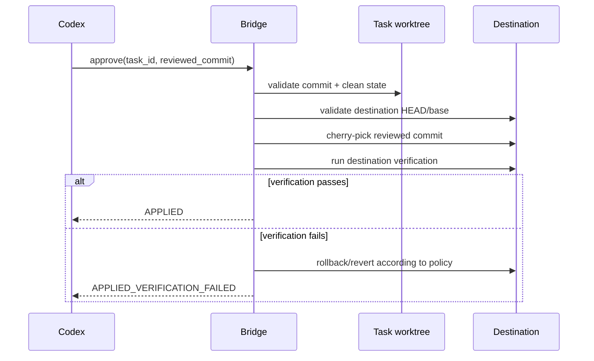

# Worktree and Safe Apply

## Isolation rule

Each active task owns one Git worktree and task branch. Codex reviews that worktree/commit; AGY never edits the destination working tree directly.

Recommended naming:

```text
branch: codex-agy/task/<task_id>
worktree: .codex-agy/worktrees/<task_id>
```

## Workspace lifecycle

1. Resolve and canonicalize repository root.
2. Reject dirty destination workspace unless policy explicitly permits it.
3. Record destination HEAD as `base_sha`.
4. Create task branch/worktree from `base_sha`.
5. AGY edits only inside the task worktree.
6. Verify task worktree.
7. Require a commit before review/apply.
8. Codex reviews diff/commit metadata.
9. Apply the exact reviewed commit(s), not arbitrary current files.
10. Verify destination after apply.
11. Clean up worktree only after terminal state or explicit retention policy.

## Safe Apply transaction



## Invariants

- Only committed, reviewed content may be applied.
- Record the exact source commit before apply.
- Never use blind file copy as the primary apply method.
- Never force reset the user's destination branch.
- Any conflict aborts the cherry-pick and records evidence.
- Verification occurs both in the worktree and after destination apply.
- Cleanup is separate from apply; failed tasks retain evidence by default.

## Multi-commit tasks

Prefer squashing task work into one reviewed commit for v1. If multi-commit apply is enabled, persist an ordered immutable commit list and verify that the list has not changed since review.

## Dirty destination

Default behavior is refusal. A future advanced mode may use a temporary integration worktree, but v1 should optimize for correctness rather than clever merging into uncommitted user changes.
